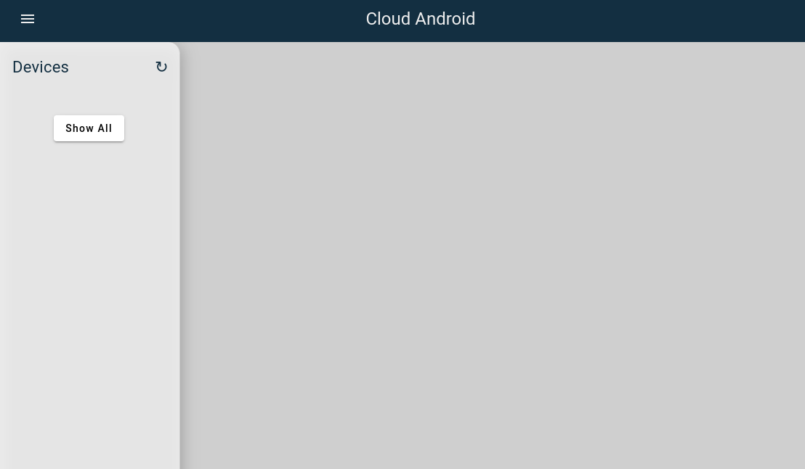

# Use cvdr from your local machine

This page describes how to run `cvdr` to use cloud orchestrator remotely.

## Build cvdr

Please run:
```bash
git clone https://github.com/google/cloud-android-orchestration.git
cd cloud-android-orchestration # Root directory of git repository
go build ./cmd/cvdr
```

## Find URL of cloud orchestrator

If cloud orchestrator manages docker instances, please read
[docker.md](docker.md) to check URL of cloud orchestrator.
Let's define this URL as `SERVICE_URL` for the rest of this page.

## Use cvdr step-by-step

### Host creation

Please run:
```bash
./cvdr \
--service_url=${SERVICE_URL} \
--zone=local \
host create
```

And we expect the result like below. Let's define this value as `HOST_NAME` from
now on.
```
bcef3e121d23e4958c9fc608966cb01e41ad842385da8d32fc9be4a2a060a580
```

If you want to validate, please refer to
`${SERVICE_URL}/v1/zones/local/hosts/${HOST_NAME}/`.
Then please check if the page seems like below.


### Cuttlefish instance creation

Let's assume using the latest Cuttlefish x86_64 image enrolled in
[ci.android.com](https://ci.android.com/).

Please run:
```bash
./cvdr \
--service_url=${SERVICE_URL} \
--zone=local \
--host=${HOST_NAME} \
--branch=aosp-main \
--build_target=aosp_cf_x86_64_phone-trunk_staging-userdebug \
--auto_connect=false \
create
```

If you want to validate, please refer to
`${SERVICE_URL}/v1/zones/local/hosts/${HOST_NAME}/`.
Then please check if the page seems like below.


### ADB connection to access shell

Please run:
```bash
./cvdr \
--service_url=${SERVICE_URL} \
--zone=local \
--host=${HOST_NAME} \
connect
```

Then we expect the result like below.
```
bcef3e121d23e4958c9fc608966cb01e41ad842385da8d32fc9be4a2a060a580/cvd-1: 127.0.0.1:41119
```

You could be able to see the device is enrolled via `adb devices`.

## Use cvdr with one time execution

Let's assume using the latest Cuttlefish x86_64 image enrolled in
[ci.android.com](https://ci.android.com/).

Please run:
```bash
./cvdr \
--service_url=${SERVICE_URL} \
--zone=local \
--branch=aosp-main \
--build_target=aosp_cf_x86_64_phone-trunk_staging-userdebug \
create
```

Then we expect the result like below.
```
Creating Host........................................ OK
Fetching main bundle artifacts....................... OK
Starting and waiting for boot complete............... OK
Connecting to cvd-1.................................. OK
2e8137432a96f93558c838da5e590ec775a97e5a7bb20e66929d1a59eb337351 (http://localhost:8080/v1/zones/local/hosts/2e8137432a96f93558c838da5e590ec775a97e5a7bb20e66929d1a59eb337351/)
  cvd/1
  Status: Running
  ADB: 127.0.0.1:33975
  Displays: [720 x 1280 ( 320 )]
  Logs: http://localhost:8080/v1/zones/local/hosts/2e8137432a96f93558c838da5e590ec775a97e5a7bb20e66929d1a59eb337351/cvds/1/logs/
```
If you want to validate, please refer the first provided URL in the output log
and check if the page seems like below.

