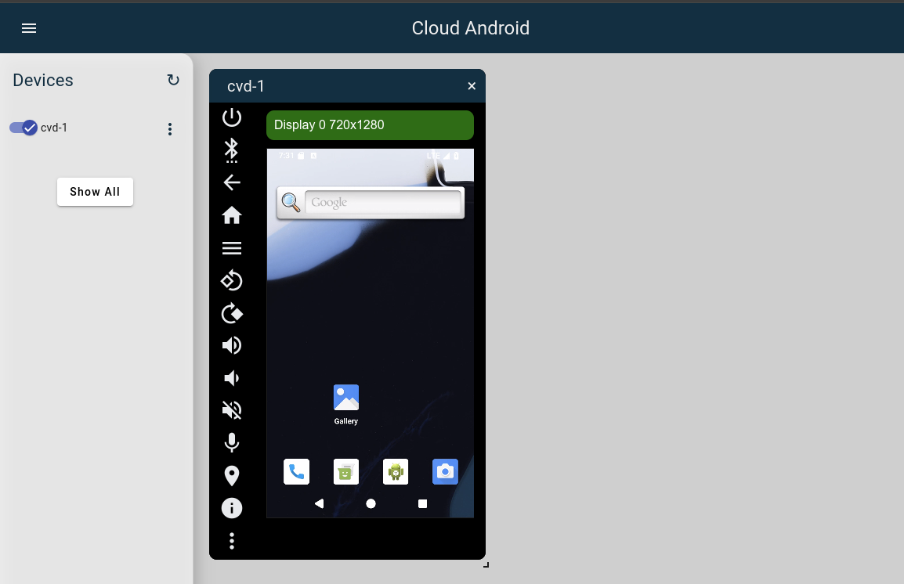

# cvdr

This page describes about `cvdr` and its usage.

## What's cvdr?

`cvdr` is a CLI binary tool for accessing and managing Cuttlefish instances
remotely.
It wraps [Cloud Orchestrator](cloud_orchestrator.md), to provide user-friendly
interface.

## Install cvdr
### Debian prebuilt packages

`cuttlefish-cvdremote` is available to download via `apt install` with adding
the apt repository at Artifact Registry.
```bash
sudo install -m 0755 -d /etc/apt/keyrings
sudo curl -fsSL https://us-apt.pkg.dev/doc/repo-signing-key.gpg -o /etc/apt/keyrings/android-cuttlefish-artifacts.asc
sudo chmod a+r /etc/apt/keyrings/android-cuttlefish-artifacts.asc
echo \
  "deb [arch=$(dpkg --print-architecture) signed-by=/etc/apt/keyrings/android-cuttlefish-artifacts.asc] \
  https://us-apt.pkg.dev/projects/android-cuttlefish-artifacts android-cuttlefish-unstable main" | \
  sudo tee /etc/apt/sources.list.d/android-cuttlefish-artifacts.list > /dev/null
sudo apt update
sudo apt install cuttlefish-cvdremote
cvdr --help
```

### Manual build

To build `cvdr` manually, please run:
```bash
git clone https://github.com/google/cloud-android-orchestration.git
cd cloud-android-orchestration # Root directory of git repository
go build ./cmd/cvdr
```

## Configure cvdr

Please check and modify the configuration file (defaults to `~/.config/cvdr/cvdr.toml`).
See either 
[build/debian/cuttlefish_cvdremote/host/etc/cvdr.toml](/build/debian/cuttlefish_cvdremote/host/etc/cvdr.toml)
or
[scripts/on-premises/single-server/cvdr.toml](/scripts/on-premises/single-server/cvdr.toml)
as examples of how to write a configuration file.


## Run CVD


```bash
CVDR_USER_CONFIG_PATH=/path/to/cvdr.toml ./cvdr --help
```

## Create CVD examples

### Latest Cuttlefish x86_64 image enrolled in [ci.android.com](https://ci.android.com/)

```bash
cvdr \
--branch=aosp-main \
--build_target=aosp_cf_x86_64_phone-trunk_staging-userdebug \
create
```

### Custom AOSP build

Ensure you have completed an AOSP build as described in the [docs](https://source.android.com/docs/setup/build/building).
To start a Cuttlefish emulator based on this build, the following environment variables should be defined:
```
export ANDROID_BUILD_TOP=/path/to/your/AOSP/sources/root
export ANDROID_PRODUCT_OUT="${ANDROID_BUILD_TOP}/out/target/product/your_target"
```
Replace the latter with the your `OUT_DIR` if you override it.

<br>

To automatically fetch the [required images](https://cs.android.com/android/platform/superproject/+/master:device/google/cuttlefish/required_images) from your AOSP root and create an instance, please run:

```bash
CVDR_USER_CONFIG_PATH=/path/to/cvdr.toml ./cvdr create --local_image
```

Alternatively, manually specify the images and create an instance:
```bash
CVDR_USER_CONFIG_PATH=/path/to/cvdr.toml ./cvdr --local_cvd_host_pkg_src="${ANDROID_PRODUCT_OUT}/dist/cvd-host_package.tar.gz --local_images_zip_src=${ANDROID_PRODUCT_OUT}/dist/your-target-img.zip"
```
For this to work, you have to build the .zip images using `m dist` in AOSP root beforehand.

<br>
On success, we expect the result like below.

```
Creating Host........................................ OK
Fetching main bundle artifacts....................... OK
Starting and waiting for boot complete............... OK
Connecting to cvd-1.................................. OK
2e8137432a96f93558c838da5e590ec775a97e5a7bb20e66929d1a59eb337351 (http://localhost:8080/v1/zones/local/hosts/2e8137432a96f93558c838da5e590ec775a97e5a7bb20e66929d1a59eb337351/)
  cvd/1
  Status: Running
  ADB: 127.0.0.1:33975
  Displays: [720 x 1280 ( 320 )]
  Logs: http://localhost:8080/v1/zones/local/hosts/2e8137432a96f93558c838da5e590ec775a97e5a7bb20e66929d1a59eb337351/cvds/1/logs/
```
If you want to validate, please refer the first provided URL in the output log
and check if the page seems like below.
Also, you should be able to see the device is enrolled via `adb devices`.


Please run `cvdr --help` for advanced functionalities of `cvdr`, including individual commands and their flags.
